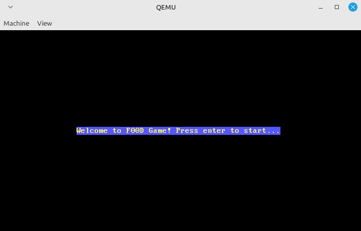
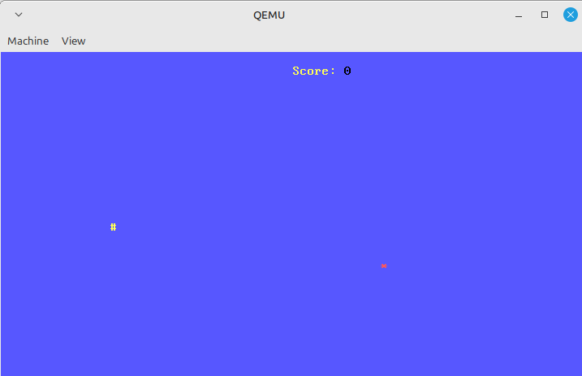

# boot2Food
boot2Food is a bootsector game. You need to be fast to reach the apple which has a life of roughly 5 seconds. If you don't, you re-start from the beginning!

## How to run

````bash
nasm -f bin boot2Food.asm -o boot2Food
qemu-system-x86_64 boot2Food
````

## Images from the game






## TO-DO:
Since a single-stage bootloader has a maximum size of 512 bytes. I didn't have the chance to:
- Check if player is at the border and stop them from leaving the screen.
- Add a "You lost" screen and show score.
